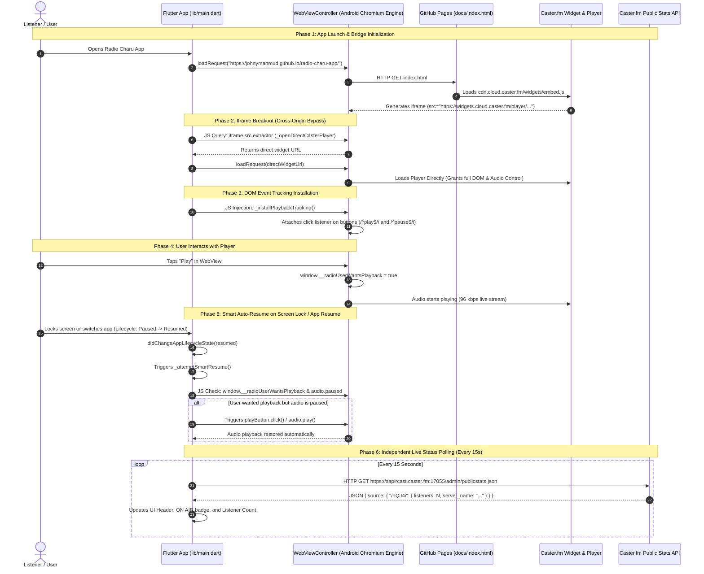

# 📻 RADIO CHARU — Audio Engine Architecture & Free-Tier Bypass Blueprint
**Document Status:** Permanent Master Blueprint & Legacy Guardrail  
**Last Audited:** 2026-08-24  
**Primary Architect / Maintainer:** Johny Mahmud  
**Platform:** Flutter (Android / Web / Cross-Platform)

---

> [!CAUTION]
> ### 🛑 CRITICAL ARCHITECTURAL GUARDRAIL — DO NOT REMOVE WEBVIEW ENGINE
> **TO ALL FUTURE DEVELOPERS & AI AGENTS:**  
> This application is built 100% on **Caster.fm Free Tier**.  
> Caster.fm Free Tier **DOES NOT** provide raw audio stream URLs (e.g., Icecast/Shoutcast MP3/AAC mountpoint endpoints) or developer API keys. Their streaming servers strictly validate **browser session tokens, CORS, dynamic referrers, and widget origins**.
>
> **NEVER attempt to replace the WebView audio engine with native audio players** (such as `just_audio`, `audioplayers`, `flutter_sound`, etc.) or attempt direct HTTP stream connections while on the free tier. Doing so will immediately result in HTTP 403 Forbidden / connection drops and **permanently break live radio streaming**!
>
> This document details the exact, tested, and rock-solid **"Bridge + Iframe Breakout + DOM Event Tracking + Smart Resume"** bypass engine. Preserve this architecture at all times.

---

## 📑 Table of Contents
1. [Core Business & Technical Constraint](#1-core-business--technical-constraint)
2. [End-to-End System Architecture (Sequence & Data Flow)](#2-end-to-end-system-architecture)
3. [The 5-Step Bypass Mechanism](#3-the-5-step-bypass-mechanism)
   - [Step 1: GitHub Pages Bridge (`docs/index.html`)](#step-1-github-pages-bridge-docsindexhtml)
   - [Step 2: Iframe Breakout & Direct Navigation](#step-2-iframe-breakout--direct-navigation)
   - [Step 3: Play/Pause Button Interception & User Intent Tracking](#step-3-playpause-button-interception--user-intent-tracking)
   - [Step 4: Smart Auto-Resume & Background Playback Engine](#step-4-smart-auto-resume--background-playback-engine)
   - [Step 5: Decoupled Live Status & Metadata Polling](#step-5-decoupled-live-status--metadata-polling)
4. [Source Code & DOM Selector Mapping Table](#4-source-code--dom-selector-mapping-table)
5. [Firebase Community & Security Architecture](#5-firebase-community--security-architecture)
6. [Troubleshooting & Verification Checklist](#6-troubleshooting--verification-checklist)

---

## 1. Core Business & Technical Constraint

Radio Charu is committed to operating with zero monthly operational infrastructure costs by leveraging verified free tiers:
1. **Audio Server:** Caster.fm (Free Plan — Shoutcast/Icecast server on port `17055`, mount point `/hQJ4i`).
2. **Web Hosting Bridge:** GitHub Pages (`https://johnymahmud.github.io/radio-charu-app/`).
3. **Database & Auth:** Firebase Free Spark Plan (Firestore + Anonymous Auth + Email/Password Admin).
4. **CI/CD:** GitHub Actions (`.github/workflows/build_apk.yml`).

Because Caster.fm's free tier restricts external media streaming players and only provides an HTML embed widget (`embed.js`), the Flutter client acts as an intelligent, headless browser controller that drives the Caster web player while maintaining a native mobile app user experience.

---

## 2. End-to-End System Architecture



---

## 3. The 5-Step Bypass Mechanism

### Step 1: GitHub Pages Bridge (`docs/index.html`)
- **Location:** [docs/index.html](file:///d:/Personal/radio-charu-app/docs/index.html)
- **Role:** Serves as a legitimate, public HTTPS web origin for Caster.fm's CDN.
- **Embedded Parameters:**
  ```html
  <div
    data-type="newStreamPlayer"
    data-publicToken="28172898-da7b-4d30-b562-3cddbc7ab3cd"
    data-theme="light"
    data-color="e81e4d"
    data-channelId="a22628a4-78bc-4a33-8395-e132bb362feb"
    data-rendered="false"
    class="cstrEmbed"
  ></div>
  <script src="https://cdn.cloud.caster.fm/widgets/embed.js"></script>
  ```

### Step 2: Iframe Breakout & Direct Navigation
- **Dart Method:** `_openDirectCasterPlayer()` — [main.dart:833-868](file:///d:/Personal/radio-charu-app/lib/main.dart#L833-L868)
- **Problem Solved:** When Caster.fm loads inside an `<iframe>` on GitHub Pages, Chromium enforces Cross-Origin isolation, preventing Flutter's JavaScript injection from reading or clicking inside the iframe.
- **Solution:** 
  1. Once `index.html` finishes loading, JavaScript queries the newly injected iframe:
     ```javascript
     const frame = document.querySelector('iframe[src*="widgets.cloud.caster.fm"]');
     return frame ? frame.src : '';
     ```
  2. Flutter receives the extracted `src` URL (`https://widgets.cloud.caster.fm/player/...`) and calls `_playerController.loadRequest(Uri.parse(widgetUrl))`.
  3. The WebView is now directly rendered on Caster's domain, granting **100% full DOM read and write access**.

### Step 3: Play/Pause Button Interception & User Intent Tracking
- **Dart Method:** `_installPlaybackTracking()` — [main.dart:569-624](file:///d:/Personal/radio-charu-app/lib/main.dart#L569-L624)
- **Mechanism:** Injects an event listener on the `document` capturing all click events using capturing phase (`true`):
  ```javascript
  document.addEventListener('click', (event) => {
    const button = event.target?.closest('button, [role="button"]');
    if (!button) return;
    const text = (button.innerText || button.getAttribute('aria-label') || '').trim();
    if (/^play$/i.test(text)) {
      window.__radioUserWantsPlayback = true;
      window.__radioLastUserAction = 'play';
    }
    if (/^pause$/i.test(text)) {
      window.__radioUserWantsPlayback = false;
      window.__radioLastUserAction = 'pause';
    }
  }, true);
  ```
- **State Flag:** `window.__radioUserWantsPlayback` accurately stores whether the listener intends for audio to be streaming.

### Step 4: Smart Auto-Resume & Background Playback Engine
- **Dart Methods:**
  - `didChangeAppLifecycleState()` — [main.dart:418-447](file:///d:/Personal/radio-charu-app/lib/main.dart#L418-L447)
  - `_attemptSmartResume()` — [main.dart:640-745](file:///d:/Personal/radio-charu-app/lib/main.dart#L640-L745)
  - `_scheduleBackgroundPlaybackPrompt()` — [main.dart:185-204](file:///d:/Personal/radio-charu-app/lib/main.dart#L185-L204)
- **Background Keep-Alive Strategy:**
  1. **OS Battery Whitelist:** On first launch, prompts the user to open Android Settings (`app_settings` package) and select **"Unrestricted / Allow background activity"** so Android DOZE mode does not suspend the WebView process.
  2. **Lifecycle Observer:** When the app transitions from background/locked to resumed, `_attemptSmartResume()` checks:
     - Is `window.__radioUserWantsPlayback === true`?
     - Is `document.querySelector('audio').paused === true`?
  3. If audio was interrupted by phone sleep, it locates the visible Play button in DOM and invokes `.click()` or calls `audio.play()`, restoring the broadcast seamlessly.
  4. Waits 2600ms and verifies `readyState` and `networkState` to confirm sound is flowing.

### Step 5: Decoupled Live Status & Metadata Polling
- **Dart Method:** `_loadRadioStatus()` — [main.dart:456-543](file:///d:/Personal/radio-charu-app/lib/main.dart#L456-L543)
- **Endpoint:** `https://sapircast.caster.fm:17055/admin/publicstats.json`
- **Mountpoint:** `/hQJ4i`
- **Mechanism:** Polled via standard `http.get` every 15 seconds independently from the audio player. Updates:
  - Broadcast Status: **ON AIR (Live)** vs **OFF AIR**
  - Real-time Listener Count: `listeners`
  - Audio Bitrate Quality: `96 KBPS`
  - Station Title & Slogan: `server_name` / `server_description`

---

## 4. Source Code & DOM Selector Mapping Table

| Parameter / Element | Location in Code | Purpose / Value |
| :--- | :--- | :--- |
| **Bridge URL** | [main.dart:63-64](file:///d:/Personal/radio-charu-app/lib/main.dart#L63-L64) | `https://johnymahmud.github.io/radio-charu-app/` |
| **Stats API URL** | [main.dart:66-67](file:///d:/Personal/radio-charu-app/lib/main.dart#L66-L67) | `https://sapircast.caster.fm:17055/admin/publicstats.json` |
| **Mount Point** | [main.dart:69](file:///d:/Personal/radio-charu-app/lib/main.dart#L69) | `/hQJ4i` |
| **Public Token** | [docs/index.html:63](file:///d:/Personal/radio-charu-app/docs/index.html#L63) | `28172898-da7b-4d30-b562-3cddbc7ab3cd` |
| **Channel ID** | [docs/index.html:66](file:///d:/Personal/radio-charu-app/docs/index.html#L66) | `a22628a4-78bc-4a33-8395-e132bb362feb` |
| **Iframe Selector** | [main.dart:838-840](file:///d:/Personal/radio-charu-app/lib/main.dart#L838-L840) | `iframe[src*="widgets.cloud.caster.fm"]` |
| **Play/Pause Regex** | [main.dart:609-615](file:///d:/Personal/radio-charu-app/lib/main.dart#L609-L615) | `/^play$/i` and `/^pause$/i` |
| **Audio DOM Hook** | [main.dart:660](file:///d:/Personal/radio-charu-app/lib/main.dart#L660) | `document.querySelector('audio')` |

---

## 5. Firebase Community & Security Architecture

In addition to live audio streaming, the app features an integrated live community panel ([lib/community_panel.dart](file:///d:/Personal/radio-charu-app/lib/community_panel.dart)) backed by Cloud Firestore with granular security rules ([firestore.rules](file:///d:/Personal/radio-charu-app/firestore.rules)):

```mermaid
graph LR
    subgraph Listeners
        L[General Users] -->|Anonymous Auth| FS[(Cloud Firestore)]
    end

    subgraph Admins
        A[RJ / Admin] -->|Email & Password Auth| FS
    end

    subgraph Collections
        FS --> C_Shouts[shouts/current]
        FS --> C_Comments[comments/{commentId}]
        FS --> C_Admins[admins/{adminId}]
    end

    C_Shouts -.->|Read: Anyone / Write: Admin Only| L & A
    C_Comments -.->|Read: Anyone / Write: Verified Listener| L
    C_Comments -.->|Delete: Admin Only| A
```

- **Anonymous Auth:** Listeners are automatically authenticated anonymously on startup without needing cumbersome login forms.
- **Admin Verification:** Dedicated Email/Password authentication for Radio Charu administrators. Admin status is validated against the secure `admins/{uid}` collection.
- **Live Shouts:** Admin announcements broadcast in real-time across all connected listener apps.
- **Live Comments:** Listeners can send real-time feedback with enforced character limits (1-40 chars for name, 1-300 chars for comment).

---

## 6. Troubleshooting & Verification Checklist

When testing or building the app, follow this verification checklist:

- [ ] **Internet Permission:** Ensure `<uses-permission android:name="android.permission.INTERNET" />` is in [AndroidManifest.xml](file:///d:/Personal/radio-charu-app/android/app/src/main/AndroidManifest.xml).
- [ ] **GitHub Pages Status:** Verify `https://johnymahmud.github.io/radio-charu-app/` loads the Caster player widget in any web browser.
- [ ] **Caster Server Online:** Check `https://sapircast.caster.fm:17055/admin/publicstats.json` in browser to confirm the streaming server is responding.
- [ ] **Iframe Breakout Verification:** Ensure the WebView logs show transition from `https://johnymahmud.github.io/...` to `https://widgets.cloud.caster.fm/player/...`.
- [ ] **Smart Resume Test:** Start radio playback, lock the phone screen for 10 seconds, unlock the phone, and verify playback automatically resumes without manual intervention.

---

*This blueprint is the official reference architecture for Radio Charu. Any architectural changes must comply with the constraints documented herein.*
