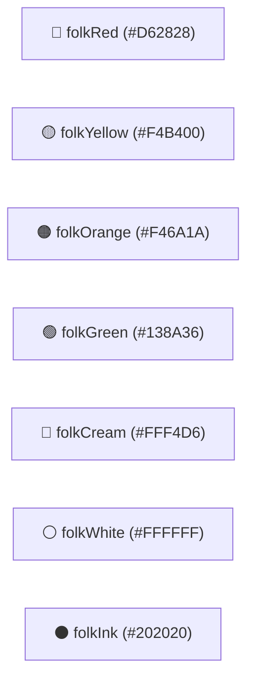

# 🎨 রেডিও চারু — ডিজাইন সিস্টেম ও লোকজ কালার প্যালেট (DESIGN SYSTEM)
**উদ্দেশ্য:** রেডিও চারুর ইউনিক ভিজ্যুয়াল আইডেন্টিটি, লোকজ কালার কোড ও টাইপোগ্রাফি গাইডলাইন  
**সর্বশেষ আপডেট:** ২৪ আগস্ট, ২০২৬  

---

## 🌈 কালার প্যালেট (Bangladeshi Folk-Inspired Palette)

রেডিও চারুর ভিজ্যুয়াল ডিজাইন ঐতিহ্যবাহী বাংলাদেশি লোকশিল্প, নকশিকাঁথা ও রিকশা পেইন্টের উজ্জ্বল রঙের সমাহারে তৈরি।

### 🎨 কালার কোড টেবিল (Color Tokens)

| কালার টোকেন নাম | HEX কোড | ডার্ট ভ্যালু | প্রধান ব্যবহার ক্ষেত্র |
| :--- | :--- | :--- | :--- |
| **`folkRed`** | `#D62828` | `Color(0xFFD62828)` | প্রাইমারি ব্র্যান্ড কালার, ON AIR ব্যাজ, প্লেয়ার বর্ডার, হেডিং |
| **`folkYellow`** | `#F4B400` | `Color(0xFFF4B400)` | লোগো ব্যাকগ্রাউন্ড, শ্যাডো, হাইলাইট বক্স, সেকশন বর্ডার |
| **`folkOrange`** | `#F46A1A` | `Color(0xFFF46A1A)` | সেকেন্ডারি অ্যাকশন বাটন, রিলোড বাটন, কোয়ালিটি ব্যাজ |
| **`folkGreen`** | `#138A36` | `Color(0xFF138A36)` | হেডার ব্যাকগ্রাউন্ড, সেটিংস/সাকসেস স্টেট, শ্রোতা সংখ্যা বক্স |
| **`folkCream`** | `#FFF4D6` | `Color(0xFFFFF4D6)` | অ্যাপের মূল ব্যাকগ্রাউন্ড (Scaffold Background) |
| **`folkWhite`** | `#FFFFFF` | `Color(0xFFFFFFFF)` | কার্ড ব্যাকগ্রাউন্ড, টেক্সট হাইলাইট, আইকন |
| **`folkInk`** | `#202020` | `Color(0xFF202020)` | বডি টেক্সট, ডার্ক বর্ডার ও কনট্রাস্ট লাইন |
| **`folkMuted`** | `#6C675F` | `Color(0xFF6C675F)` | সাবটাইটেল, সেকেন্ডারি লেবেল ও টাইমস্ট্যাম্প |

---

## 🔤 টাইপোগ্রাফি (Typography)

- **ডিফল্ট ফন্ট:** `Roboto`, `sans-serif` (বাংলা টেক্সটের জন্য সিস্টেম ডিফল্ট সুন্দর রেন্ডারিং)।
- **স্টাইল রুলস:**
  - **হেডার ও ব্র্যান্ড নাম:** Extra Bold / Black (`FontWeight.w900`), `letterSpacing: 0.4`
  - **সেকশন শিরোনাম:** Bold (`FontWeight.w800`), `fontSize: 15-18`
  - **বডি টেক্সট:** Medium (`FontWeight.w500` / `w600`), `height: 1.4-1.5`
  - **স্ট্যাটাস ও লেবেল:** Heavy (`FontWeight.w700`), `fontSize: 12-14`

---

## 🎛️ মূল UI কম্পোনেন্ট ও ডিজাইনের নিয়ম

1. **কার্ড ও কনটেইনার:**
   - বর্ডার রেডিয়াস: `16px - 22px` (Smooth Rounded Corners)।
   - বর্ডার: `2px - 3px` সলিড বর্ডার (`folkRed`, `folkGreen` বা `folkInk`)।
   - পপ শ্যাডো: ফ্ল্যাট সলিড কালার অফসেট শ্যাডো (`offset: Offset(6, 6)`, `blurRadius: 0`, Color: `folkYellow`)।
2. **বাটন:**
   - বাটন সবসময় বোল্ড টেক্সট ও আইকন সহ থাকবে।
   - প্যাডিং: ভার্টিক্যাল `12px - 14px`।
3. **লোগো:**
   - কাস্টম ভেক্টর রেডিও অ্যান্টেনা ও স্পিকার আইকন ([lib/widgets/radio_logo.dart](file:///d:/Personal/radio-charu-app/lib/widgets/radio_logo.dart))।

---

> [!TIP]
> নতুন কোনো UI স্ক্রিন বা উইজেট তৈরি করার সময় সবসময় এই ফাইলের কালার টোকেন ও ফন্ট স্টাইল অনুসরণ করুন। কখনো সাধারণ জেনেরিক কালার ব্যবহার করবেন না।
