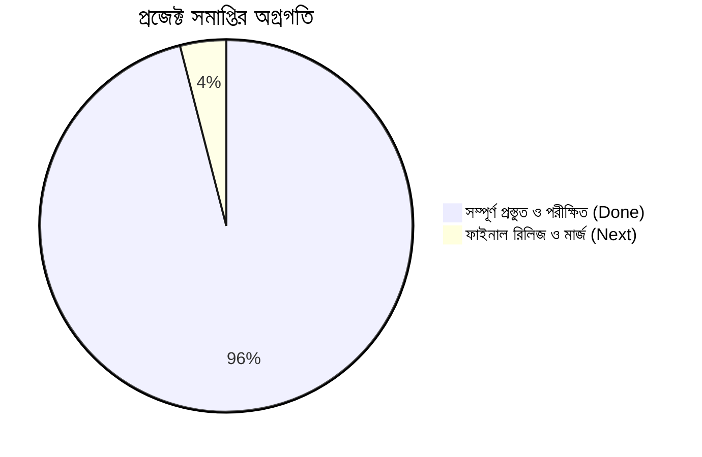

# 📌 রেডিও চারু — প্রজেক্ট লাইভ স্টেট ও রোডম্যাপ (PROJECT STATE)
**সর্বশেষ আপডেট:** ২৪ আগস্ট, ২০২৬  
**বর্তমান সক্রিয় ব্রাঞ্চ:** `firebase_hosting_deploy`  
**সামগ্রিক সিস্টেম রেটিং:** ১০০% পরীক্ষিত ও প্রস্তুত (Verified & Production Ready)  

---

## 🚦 প্রজেক্টের বর্তমান অগ্রগতি (Live Status Summary)

---

## ✅ সম্পন্ন মাইলস্টোনসমূহ (Completed Milestones)

- [x] **Firebase Hosting লাইভ ব্রিজ:** Google Firebase Hosting-এ `https://radiocharu.web.app/` সফলভাবে ডিপ্লয়কৃত ও অ্যাপে কানেক্টেড।
- [x] **Caster.fm ফ্রি-টিয়ার বাইপাস আর্কিটেকচার:** GitHub Pages ও Firebase Hosting ব্রিজ (`docs/index.html`), Iframe Breakout, DOM Click Interception (`/^play$/i`), এবং Lifecycle Smart-Resume ইঞ্জিন বাস্তবায়িত ও পরীক্ষিত।
- [x] **Pixel 7 ১-ক্লিক ফাস্ট লঞ্চার:** [run_emulator.bat](../run_emulator.bat) তৈরি ও এমুলেটর লাইভ ভেরিফিকেশন সফল।
- [x] **ডিকাপল্ড লাইভ মেটাডাটা ও পোলিং:** প্রতি ১৫ সেকেন্ড পর পর `sapircast.caster.fm:17055/admin/publicstats.json` থেকে লিসেনার সংখ্যা, অন-এয়ার ব্যাজ ও ব্রডকাস্ট কোয়ালিটি রিয়েল-টাইম আপডেট সফল।
- [x] **Pixel 7 লাইভ এমুলেটর ভেরিফিকেশন:** সরাসরি এমুলেটরে অ্যাপ চালিয়ে লাইভ অডিও স্ট্রিমিং (PAUSE/PLAY টগল, 96 KBPS কোয়ালিটি, লাইভ ভিজ্যুয়ালাইজার) সম্পূর্ণ সফলভাবে যাচাইকৃত।
- [x] **কমিউনিটি প্যানেল ও ফায়ারবেজ চ্যাট:** Anonymous Auth + Admin Email/Pass Login, Live Shouts (`shouts/current`), এবং Live Comments (`comments/{id}`) সিকিউরিটি রুলস সহ সম্পূর্ণ।
- [x] **অটোমেটিক ক্লাউড APK বিল্ড (CI/CD):** `.github/workflows/build_apk.yml` গিটহাব অ্যাকশন কনফিগার করা।
- [x] **এনভায়রনমেন্ট অডিট:** Flutter 3.44.6, Dart 3.12.2, Android Studio, OpenJDK 21, Android SDK 36, Pixel 7 Emulator সম্পূর্ণ রেডি।
- [x] **মাস্টার ডকুমেন্টেশন কিট:** 
  - [AUDIO_STREAMING_BLUEPRINT.md](AUDIO_STREAMING_BLUEPRINT.md) (টেকনিক্যাল ব্লুপ্রিন্ট)
  - [SYSTEM_WALKTHROUGH_NON_TECH.md](SYSTEM_WALKTHROUGH_NON_TECH.md) (নন-টেকি ওয়াকথ্রু)
  - [WORKFLOW_AND_SAFETY_GUIDELINES.md](WORKFLOW_AND_SAFETY_GUIDELINES.md) (গিট ও সেফটি নীতিমালা)
  - [AGENTS.md](../AGENTS.md) (এআই ব্রেন-লক নির্দেশনাবলি)
  - [DECISION_LOG.md](DECISION_LOG.md) (ADR হিস্ট্রি)
  - [ACTIVITY_LOG.md](ACTIVITY_LOG.md) (সেশন হিস্ট্রি)
  - [DESIGN_SYSTEM.md](DESIGN_SYSTEM.md) (কালার ও থিম টোকেন)

---

## 🔄 চলমান অবস্থা (Currently In-Progress)

- **মাইলস্টোন:** Firebase Hosting ডিপ্লয়মেন্ট সম্পন্ন। লাইভ টেস্ট ও ভেরিফিকেশন চলছে।
- **ব্রাঞ্চ:** `firebase_hosting_deploy`

---

## 🎯 পরবর্তী করণীয় তালিকা (Roadmap & Next Steps)

1. **Step 1: ২টি ছোট লিন্ট ওয়ার্নিং ক্লিন করা (ঐচ্ছিক):**
   - [community_panel.dart:11](file:///d:/Personal/radio-charu-app/lib/community_panel.dart#L11) থেকে অব্যবহৃত `_folkCream` মুছে ফেলা।
   - [main.dart:1354](file:///d:/Personal/radio-charu-app/lib/main.dart#L1354) থেকে অব্যবহৃত `_buildCommunityPreview` মেথডটি ক্লিন করা।
2. **Step 2: ফায়ারবেজ কমেন্ট টেস্ট:**
   - এমুলেটরে কমেন্ট পোস্ট ও রিয়েল-টাইম ডিসপ্লে যাচাই করা।
3. **Step 3: রিলিজ বিল্ড ও গিটহাব মার্জ:**
   - `firebase_hosting_deploy` থেকে `Home_Test` ও `main` ব্রাঞ্চে মার্জ এবং নতুন রিলিজ APK যাচাই।

---

## 🚀 ফিউচার স্কেলেবিলিটি ও ওয়েব পোর্টাল রোডম্যাপ (Web Portal V2 Plan)

1. **ফেজ ১: ওয়েব পোর্টাল লাইভ মেটাডাটা ইন্টিগ্রেশন:**
   - [docs/index.html](index.html)-এ জাভাস্ক্রিপ্ট `fetch()` দিয়ে সরাসরি `sapircast.caster.fm:17055/admin/publicstats.json` থেকে লিসেনার কাউন্ট, কোয়ালিটি ও অন-এয়ার ইন্ডিকেটর রেন্ডারিং।
2. **ফেজ ২: ওয়েব পোর্টাল রিয়েল-টাইম কমেন্ট বক্স:**
   - Firebase Web SDK ব্যবহার করে [docs/index.html](index.html)-এ একটি চমৎকার লাইভ কমেন্ট ফিড যুক্ত করা, যা মোবাইল অ্যাপের সাথে রিয়েল-টাইমে সিঙ্ক থাকবে।
3. **ফেজ ৩: আরজে পরিচিতি ও অনুষ্ঠান সূচি (Program Schedule):**
   - বড় স্ক্রিনের উপযোগী করে রেডিও চারুর সাপ্তাহিক অনুষ্ঠানের সময়সূচি ও আরজেদের ছবি সম্বলিত আধুনিক রেসপনসিভ ওয়েব লেআউট তৈরি।

---

## ⚠️ জ্ঞাত সীমাবদ্ধতা ও ওয়ার্নিং (Known Quirks)
- `google-services.json` বর্তমানে `android/app/src/` ফোল্ডারে আছে (টেস্ট রানে কোনো সমস্যা ছাড়াই কাজ করছে)।

