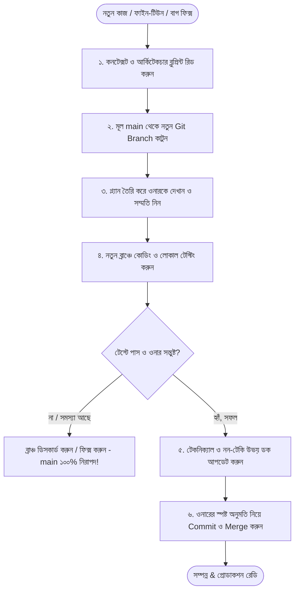

# 🛡️ রেডিও চারু (Radio Charu) — ডেভেলপমেন্ট, গিট সেফটি ও কন্ট্রিবিউশন নীতিমালা
**ডকুমেন্ট ধরন:** অফিসিয়াল ডেভেলপমেন্ট পলিসি ও সেফটি গাইডলাইন (Workflow & Safety Policy)  
**সংরক্ষণ তারিখ:** ২৪ আগস্ট, ২০২৬  
**প্রযোজ্য:** সকল AI Agent, সফটওয়্যার ইঞ্জিনিয়ার, কন্ট্রিবিউটার এবং প্রজেক্ট মেইনটেইনার  

---

> [!IMPORTANT]
> ### 🛑 সর্বপ্রধান নিয়ম (GOLDEN SAFETY RULE):
> **কোনো ডেভেলপার বা এআই এজেন্ট কখনোই সরাসরি `main` ব্রাঞ্চে কোনো কোড এডিট, এক্সপেরিমেন্ট বা ফাইন-টিউনিং করবে না।**  
> মূল `main` ব্রাঞ্চটি হলো শতভাগ পরীক্ষিত ও সফল **"গোল্ডেন স্টেট (Working State)"**। যেকোনো নতুন কাজ শুরু করার পূর্বে বাধ্যতামূলকভাবে নতুন ব্রাঞ্চ তৈরি করতে হবে এবং ওনারের অনুমতি ছাড়া কখনোই কোনো কমিট বা পুশ করা যাবে না।

---

## 📑 বিষয়সূচি
1. [উন্নয়ন ও পরিবর্তন চক্রের ৬-দফা ফ্লোচার্ট](#১-উন্নয়ন-ও-পরিবর্তন-চক্রের-৬-দফা-ফ্লোচার্ট)
2. [ধাপ ১: পূর্বপ্রস্তুতি ও কনটেক্সট স্টাডি (Study Before Code)](#ধাপ-১-পূর্বপ্রস্তুতি-ও-কনটেক্সট-স্টাডি)
3. [ধাপ ২: বাধ্যতামূলক পৃথক Git Branch তৈরি (Branch Isolation)](#ধাপ-২-বাধ্যতামূলক-পৃথক-git-branch-তৈরি)
4. [ধাপ ৩: প্ল্যানিং উপস্থাপন ও ওনারের স্পষ্ট সম্মতি (Planning & Approval)](#ধাপ-৩-প্ল্যানিং-উপস্থাপন-ও-ওনারের-স্পষ্ট-সম্মতি)
5. [ধাপ ৪: কোডিং, ফাইন-টিউনিং ও লোকাল টেস্টিং (Testing Period)](#ধাপ-৪-কোডিং-ফাইন-টিউনিং-ও-লোকাল-টেস্টিং)
6. [ধাপ ৫: উভয় ডকুমেন্টেশন আপডেট (Dual-Doc Auto Sync)](#ধাপ-৫-উভয়-ডকুমেন্টেশন-আপডেট)
7. [ধাপ ৬: অনুমোদিত Commit, Push ও Merge নীতি (Owner Authorization)](#ধাপ-৬-অনুমোদিত-commit-push-ও-merge-নীতি)

---

## ১. উন্নয়ন ও পরিবর্তন চক্রের ৬-দফা ফ্লোচার্ট



---

## ধাপ ১: পূর্বপ্রস্তুতি ও কনটেক্সট স্টাডি
- যেকোনো কোড ফাইল খোলার আগে এজেন্ট বা ডেভেলপারকে অবশ্যই নিচের ৩টি ডকুমেন্ট পড়ে প্রজেক্টের বর্তমান মেকানিজম বুঝতে হবে:
  1. 🛠️ **টেকনিক্যাল ব্লুপ্রিন্ট:** [docs/AUDIO_STREAMING_BLUEPRINT.md](AUDIO_STREAMING_BLUEPRINT.md)
  2. 📖 **নন-টেকনিক্যাল গাইড:** [docs/SYSTEM_WALKTHROUGH_NON_TECH.md](SYSTEM_WALKTHROUGH_NON_TECH.md)
  3. 🔒 **ডাটাবেজ ও সিকিউরিটি রুলস:** [firestore.rules](../firestore.rules)
- **উদ্দেশ্য:** কোনো তথ্য না জেনে বা ভুল ধারণা নিয়ে যেন বর্তমান ফ্রি-টিয়ার বাইপাস সিস্টেম ক্ষতিগ্রস্ত না হয়।

---

## ধাপ ২: বাধ্যতামূলক পৃথক Git Branch তৈরি
- প্রজেক্টের `main` ব্রাঞ্চ সবসময় সুরক্ষিত রাখতে হবে।
- যেকোনো কাজ শুরুর প্রথম কমান্ড হবে একটি নতুন ফিচারেবল ব্রাঞ্চ তৈরি করা:
  ```bash
  # ১. নিশ্চিত করুন আপনি আপ-টু-ডেট main ব্রাঞ্চে আছেন
  git checkout main
  git pull origin main

  # ২. কাজের ধরন অনুযায়ী অর্থপূর্ণ নতুন ব্রাঞ্চ খুলুন
  git checkout -b feature/audio-smart-resume-upgrade
  # অথবা
  git checkout -b fix/comment-scroll-behavior
  # অথবা
  git checkout -b experiment/ui-spectrum-redesign
  ```
- **সুবিধা:** নতুন কাজের কারণে যদি কোনো ত্রুটি হয়, এক কমান্ডেই `git checkout main` দিয়ে পূর্বের নিখুঁত সিস্টেমে ফেরত যাওয়া যাবে; কোনো কোড লস হবে না।

---

## ধাপ ৩: প্ল্যানিং উপস্থাপন ও ওনারের স্পষ্ট সম্মতি
- কোড পরিবর্তন বা যুক্ত করার আগে ডেভেলপার/এজেন্ট একটি সংক্ষেপ প্ল্যান ওনারকে জানাবে:
  - কী পরিবর্তন করা হচ্ছে?
  - কেন করা হচ্ছে?
  - কোন কোন ফাইল প্রভাবিত হবে?
- **ওনার "হ্যাঁ / করো / Proceed" বলার পরেই কেবল কোডে হাত দেওয়া যাবে।**

---

## ধাপ ৪: কোডিং, ফাইন-টিউনিং ও লোকাল টেস্টিং
- কোড পরিবর্তনের পর একা একাই "কাজ শেষ" বলে দাবি করা যাবে না। নিচের ধাপগুলো যাচাই করতে হবে:
  1. `flutter analyze` চালিয়ে দেখতে হবে কোনো সিনট্যাক্স এরর বা ওয়ার্নিং আছে কি না।
  2. এমুলেটরে অ্যাপ রান করে লাইভ স্ট্রিমিং ও ব্যাকগ্রাউন্ড অডিও বাজিয়ে দেখতে হবে।
  3. ওনারকে টেস্ট করার জন্য পর্যাপ্ত সময় দিতে হবে।

---

## ধাপ ৫: উভয় ডকুমেন্টেশন আপডেট (Dual-Doc Auto Sync)
যদি কোডবেজে কোনো মেকানিজম, আর্কিটেকচার, এন্ডপয়েন্ট বা ইউজার ইন্টারফেসে পরিবর্তন আসে, তবে সাথে সাথে নিচের ২টি ফাইল আপডেট করতে হবে:
1. **[docs/AUDIO_STREAMING_BLUEPRINT.md](AUDIO_STREAMING_BLUEPRINT.md)** — টেকনিক্যাল ডায়াগ্রাম, ফাংশনের লাইন রেফারেন্স ও ডোম সিলেক্টর আপডেট।
2. **[docs/SYSTEM_WALKTHROUGH_NON_TECH.md](SYSTEM_WALKTHROUGH_NON_TECH.md)** — সহজ ভাষায় নতুন ফিচারের গল্প ও ব্যবহারের নিয়ম আপডেট।

---

## ধাপ ৬: অনুমোদিত Commit, Push ও Merge নীতি

> [!CAUTION]
> **অনুমতি ছাড়া রিমোট গিটহাবে Commit ও Push করা সম্পূর্ণ নিষিদ্ধ।**

- এআই এজেন্ট বা ডেভেলপার নিজে থেকে একা একা কখনোই `git commit` বা `git push` চালাবে না।
- **সঠিক প্রক্রিয়া:**
  1. ওনারকে পরিবর্তিত ফাইলগুলোর তালিকা (`git status` / `git diff`) দেখানো হবে।
  2. ওনার নিজে টেস্ট করে চূড়ান্ত সন্তুষ্টি প্রকাশ করার পর ওনারকে জিজ্ঞেস করতে হবে:  
     *"সব পরীক্ষা সফল হয়েছে। আমি কি এই ব্রাঞ্চটি Commit ও Push করব?"*
  3. ওনারের স্পষ্ট অনুমতি পাওয়ার পরেই কেবল অর্থপূর্ণ কমিট মেসেজ দিয়ে পুশ করা হবে:
     ```bash
     git add .
     git commit -m "feat(audio): enhance smart resume recovery delay"
     git push origin feature/audio-smart-resume-upgrade
     ```
  4. এরপর ওনারের অনুমতিতে Pull Request / Merge করে মূল `main` ব্রাঞ্চে যুক্ত করা হবে।

---

## 📌 সংক্ষেপে ডেভেলপার ও এজেন্টের চেকলিস্ট

| পর্যায় | করণীয় | স্ট্যাটাস চেকলিস্ট |
| :--- | :--- | :---: |
| **কাজ শুরুর পূর্বে** | ব্লুপ্রিন্ট রিড করা হয়েছে? | [ ] |
| **ব্রাঞ্চিং** | `main` ছেড়ে নতুন ফিচার ব্রাঞ্চ খোলা হয়েছে? | [ ] |
| **অনুমতি** | ওনারের কাছ থেকে প্ল্যানের সম্মতি নেওয়া হয়েছে? | [ ] |
| **টেস্টিং** | `flutter analyze` ও এমুলেটরে টেস্ট পাস হয়েছে? | [ ] |
| **ডকুমেন্টেশন** | টেকনিক্যাল ও নন-টেকি উভয় ফাইল আপডেট হয়েছে? | [ ] |
| **কমিট ও পুশ** | ওনারের স্পষ্ট অনুমতির পর পুশ করা হচ্ছে? | [ ] |

---

*এই নীতিমালা রেডিও চারু প্রজেক্টের স্থায়ী শৃঙ্খলা, ডেটা নিরাপত্তা এবং সিস্টেমের স্থায়িত্ব নিশ্চিত করে।*
